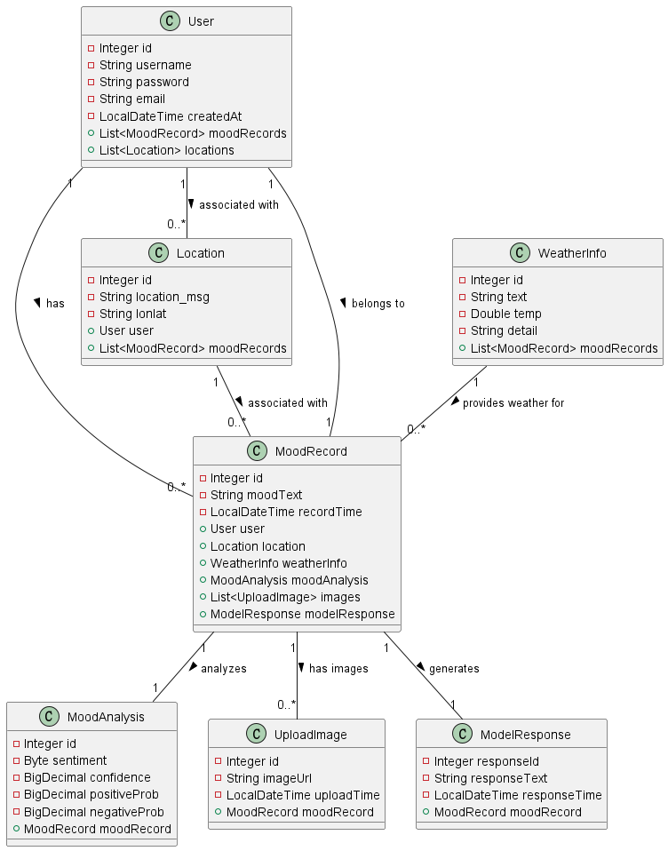
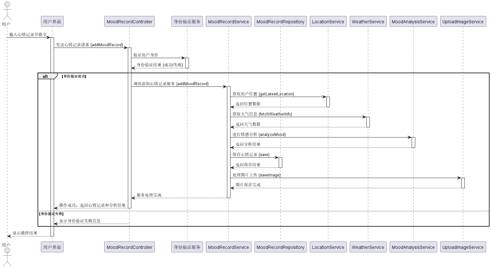
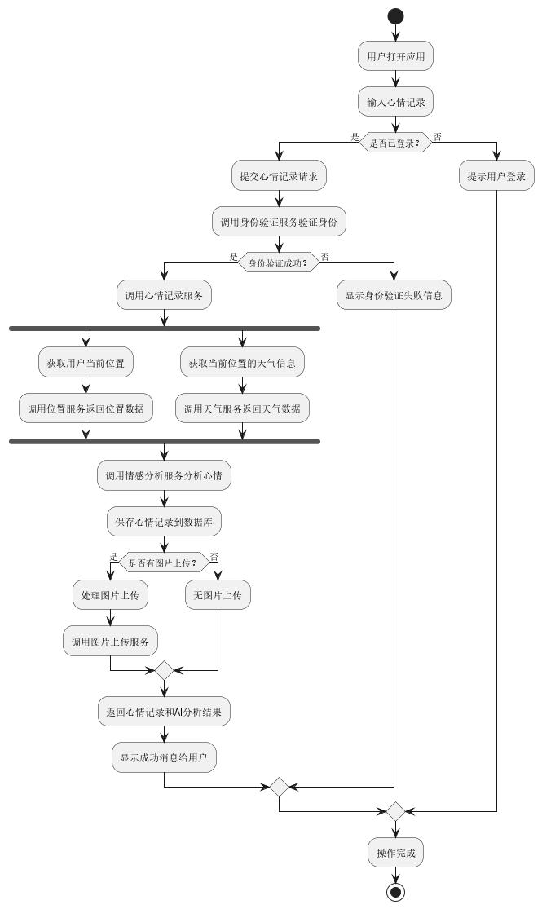

[TOC]

### 1. 项目概述

该应用的开发旨在满足用户对情绪管理和自我反思的需求，通过心情记录、情感分析和AI智能建议功能，帮助用户更好地应对情绪波动，实现心理健康的改善。基于用户情绪数据的可视化和分析功能，将用户的情绪变化清晰地呈现出来，便于用户进行长期的情绪跟踪和管理。为了实现这一目标，项目设计了多个关键模块，以确保系统功能的全面性和用户体验的优化。

#### 1.1 需求分析

##### 1.1.1 功能需求

1. **用户管理**：
   - 用户可以注册、登录、修改个人信息和找回密码。
   - 用户应能够安全地管理个人账户信息。
2. **心情记录与分析**：
   - 用户可以记录每日心情，并上传图片。
   - 系统应提供情绪分析，并生成个性化建议。
3. **天气查询与位置服务**：
   - 用户可以查看当前位置的天气情况。
   - 系统可以通过地图展示与心情记录相关的地理位置信息。
4. **新闻与内容推荐**：
   - 用户每天可以获取最新的新闻和积极的鸡汤语录。
   - 系统应能够提供内容推荐，增强用户体验。

#### 1.1.2 非功能需求

1. **性能**：
   - 系统应快速加载主要页面和数据。
   - 系统支持并发用户访问，保证不因高流量而显著降低响应速度。
2. **安全性**：
   - 用户数据应加密存储，敏感信息（如密码）需进行散列处理。
   - 系统应防范常见的网络攻击，如 SQL 注入和 XSS 攻击。
3. **可用性**：
   - 系统应在高峰时间保证 可用性。
4. **可扩展性**：
   - 系统应具有模块化结构，方便未来功能扩展。
   - 支持增加新的分析功能或集成新的外部 API。

#### 1.1.3 用户需求

1. 用户需要一个简单易用的应用来记录他们的心情状态并获取情绪分析建议。
2. 用户希望获取与自己位置相关的天气信息，以便了解情绪变化与环境的联系。
3. 用户要求支付功能安全可靠，以便购买个性化服务或查看增值分析报告。
4. 用户希望应用能够每日提供新内容，包括新闻和积极的鸡汤语录，以提升用户体验。

#### 1.1.4 系统需求

1. **前端需求**：前端应能够与后端进行高效的数据交互，保证用户界面的响应速度和数据展示的实时性。
2. **后端需求**：后端需提供稳定可靠的 RESTful API 服务，并能与第三方 API 进行集成，如情绪分析、支付、天气和位置服务等。
3. **数据存储需求**：数据库应保证用户数据的完整性和安全性，并支持高效查询与存储。

#### 1.2 项目目标

1. **提升用户情绪管理意识**：
   通过提供便捷的情绪记录功能，帮助用户以数字化的方式管理情绪，提升用户对自己情绪的觉察能力，并通过长期追踪情绪变化，提高用户的情感调节能力。
2. **情感分析驱动的个性化服务**：
   通过情感分析和用户历史记录的结合，提供个性化的推荐和情绪调节建议，帮助用户在日常生活中找到适合自己的心理调节方式，从而更好地应对负面情绪。
3. **构建情绪数据的长期价值**：
   为用户提供长期情绪数据的可视化与分析服务，帮助用户通过历史数据的积累，发现自身情绪变化的规律，进而优化心理健康管理策略。
4. **增强用户体验与平台性能**：
   通过优化的前后端架构，确保应用具备高性能和高可靠性。前后端的分离设计和外部服务的集成将提高系统的可扩展性，使其在用户群体增长后依然能保持流畅的使用体验。

#### 1.3 主要功能

- **生活记录与管理**：用户可以记录每日的心情，并上传图片以供查看历史记录。在提交记录时，系统会调用情感分析服务，为用户提供情感反馈和个性化建议。
- **位置与天气查询功能**：通过调用位置和天气服务 API，用户可以获取当前位置的实时天气信息。该功能通过前端 Vue.js 与后端 Spring Boot 的集成实现，后端调用外部天气 API 并将数据展示在用户界面中。
- **图片生成与管理**：用户可以上传图片以及通过描述生成图片，系统会将其保存至服务器指定目录并生成 URL 地址供用户查看。
- **每日新闻与鸡汤语录**：系统通过调用外部 API，为用户提供每日新闻和积极的鸡汤语录，提升用户体验。

系统采用前后端分离的设计模式，前端使用 Vue.js，后端基于 Spring Boot 提供 RESTful API 服务。数据库采用 MySQL，确保数据的持久化和安全性。

### 2. 系统架构设计

#### 2.1 总体架构

- 本系统基于Spring Boot框架进行开发，采用分层架构来实现系统模块化，确保良好的扩展性和可维护性。
- **前端**：前端使用Vue.js进行开发，与用户进行交互，如收集心情信息、展示心情记录、AI回复和天气信息等。前端与后端通过RESTful API通信，组件化设计保证代码的重用性和可维护性。
- **后端**：后端由Spring Boot支持，负责业务逻辑处理、数据库交互及与外部服务集成。通过Spring Data JPA与MySQL数据库交互，保证数据库访问的高效性和可靠性，并使用RestTemplate与外部API集成。
- **数据库**：使用MySQL存储用户信息、心情记录、位置、天气等数据，采用关系型设计，确保数据的完整性与一致性。
- **外部API集成**：系统集成了多个外部API（如天气API、新闻API、心灵鸡汤API、ChatGLM等）来实现心情分析、天气查询和生成AI回复，丰富了系统的功能和用户体验。

#### 2.2 系统主要模块

1. **用户模块**：负责用户的注册、登录、身份验证及管理。
2. **心情记录模块**：用于用户的心情记录管理，包括添加、修改、删除心情记录，以及生成AI的心情分析回复。
3. **位置与天气模块**：用于获取用户的地理位置信息，并基于此信息查询天气数据。
4. **情感分析与生成模块**：使用Baidu NLP API和ChatGLM API进行情感分析，生成心情相关的AI文本回复。
5. **图像上传生成模块**：通过文本生成图像，用户可以输入描述性文字，并调用API生成相关图片。

#### 2.3 数据库ER图设计


#### 2.4 类图设计



#### 2.5 时序图设计



#### 2.6 活动图设计



### 3. 技术栈与工具

#### 3.1 技术栈

1. **编程语言**：
   - **JavaScript**：用于前端开发，JavaScript 是一门动态语言，广泛用于构建交互式用户界面，具有灵活性和庞大的社区支持。
   - **Java**：用于后端开发，Java 提供了面向对象的编程特性，具有较高的稳定性和性能，适用于构建企业级应用。
2. **框架与库**：
   - **Vue.js**：用于构建用户界面，Vue.js 提供灵活的组件化开发方式，支持响应式数据绑定，适合构建现代化的前端应用。
   - **Spring Boot**：用于构建 RESTful API 服务，Spring Boot 简化了配置工作，能够快速搭建健壮的后端服务。
   - **Spring Security**：用于实现用户身份验证和授权管理，确保系统的安全性，通过集成 JWT 实现无状态会话管理。
   - **Axios**：用于前端与后端之间的数据通信，简化了 HTTP 请求的处理，方便与 RESTful API 交互。
3. **数据库**：
   - **MySQL**：作为数据存储的解决方案，MySQL 具有高效的查询性能和稳定性，适合存储结构化数据。
   - **Spring Data JPA**：用于简化数据库交互操作，减少开发中的样板代码，提高开发效率。

#### 3.2 开发工具

1. **开发环境**：
   - **IntelliJ IDEA**：用于后端开发，提供了强大的代码编辑和调试功能，提升开发效率。
   - **Visual Studio Code (VSCode)**：用于前端开发，VSCode 拥有丰富的插件支持，适合 JavaScript 开发，提升代码编辑和调试体验。
2. **版本控制**：
   - **Git**：用于代码版本控制，便于协作开发和代码管理，保证代码的历史可追溯性。
   - **GitHub**：作为远程代码托管平台，方便团队协作、代码审查和项目管理。
3. **构建工具**：
   - **Maven**：用于管理项目依赖和构建后端应用，确保项目的一致性和可移植性。

### 4. 系统功能设计与实现

#### 4.1 用户注册与登录功能

- **功能描述**：用户可以通过用户名、密码和邮箱注册新账户，之后可以使用用户名和密码登录系统。

- **实现**：

  - `UserController`：使用`@PostMapping("/register")`和`@PostMapping("/login")`分别处理用户注册和登录请求。
  - `UserService`：封装用户注册和登录逻辑，调用`UserRepository`保存和查询用户数据，并使用BCrypt加密密码以确保安全性。

- **代码示例**：

  ```java
  @PostMapping("/register")
  public ResponseEntity<?> registerUser(@RequestBody Map<String, String> userDTO) {
      User user = userService.registerUser(userDTO.get("username"), userDTO.get("password"), userDTO.get("email"));
      return ResponseEntity.ok(user);
  }
  ```

#### 4.2 心情记录管理

- **功能描述**：用户可以记录他们的心情、上传图片、获取AI回复，并查看历史记录。

- **实现**：

  - **主要流程**：
    - 用户通过`MoodRecordController`添加心情记录，调用`@PostMapping("/add")`接口。`MoodRecordService`负责业务逻辑，将心情文本、图片等信息保存。
    - 系统通过`LocationService`获取用户当前的位置信息，并通过`WeatherService`查询天气，将这些数据关联到心情记录中。
    - 最后，调用`ModelResponseService`生成AI回复，并将结果保存到`ModelResponse`实体。
  - `MoodRecordController`：
    - 负责处理心情记录的添加、获取和删除。
    - 使用`@PostMapping("/add")`用于添加新心情记录，并支持上传图片。
    - 使用`@GetMapping("/history")`提供接口，供用户获取历史心情记录。
  - `MoodRecordService`：
    - 管理心情记录的具体业务逻辑，包括自动关联位置信息、天气信息和图片。
    - **图片上传**：通过Spring的`MultipartFile`接口实现对图片的上传和保存，并将图片路径存储到数据库中。

- **代码示例**：

  ```java
  @PostMapping("/add")
  public ResponseEntity<?> addMoodRecord(@RequestParam("userId") Integer userId,
                                         @RequestParam(value = "moodText", required = false) String moodText,
                                         @RequestParam(value = "images", required = false) MultipartFile[] images) {
      MoodRecord newMoodRecord = moodRecordService.addMoodRecord(moodText, userId, images);
      return ResponseEntity.ok(newMoodRecord);
  }
  ```

#### 4.3 情感分析功能

- **功能描述**：分析用户心情文本并生成情感标签（如积极、中性、消极）及相关的置信度。

- **实现**：

  - **API交互**：
    - `MoodAnalysisService`使用百度NLP API进行情感分析，将用户的文本发送至API并解析返回的情感信息。
    - **错误处理**：如果API调用失败，系统会捕获异常并返回适当的错误信息。
  - **数据持久化**：
    - 将解析后的情感结果保存到`MoodAnalysis`实体中。

- **代码示例**：

  ```java
  public MoodAnalysis analyzeMood(String text) throws Exception {
      // 调用百度NLP API进行情感分析
      String requestUrl = apiUrl + "?access_token=" + accessToken;
      String requestBody = "{\"text\":\"" + text + "\"}";
      String response = restTemplate.postForObject(requestUrl, requestBody, String.class);
      JsonNode root = objectMapper.readTree(response);
      Byte sentiment = (byte) root.path("items").get(0).path("sentiment").asInt();
      
      // 创建MoodAnalysis实体并保存情感结果
      MoodAnalysis moodAnalysis = new MoodAnalysis();
      moodAnalysis.setSentiment(sentiment);
      return moodAnalysisRepository.save(moodAnalysis);
  }
  ```

#### 4.4 天气信息查询

- **功能描述**：用户可以查看其当前位置的天气信息，系统自动更新位置和相关天气。

- **实现**：

  - `WeatherController`：
    - 提供天气查询接口，例如`@GetMapping("/current")`用于获取当前用户的最新天气信息。
  - `WeatherService`：
    - 调用外部天气API，获取指定位置的天气信息，并将其保存到数据库。
    - 使用缓存机制来减少API调用次数，提高系统效率。

- **代码示例**：

  ```java
  @GetMapping("/current")
  public ResponseEntity<?> fetchWeatherForCurrentUser(@RequestParam("userId") Integer userId) {
      Optional<Location> locationOpt = locationService.getLatestLocationByUserId(userId);
      WeatherInfo weatherInfo = weatherService.fetchWeatherInfo(locationOpt.get());
      return ResponseEntity.ok(weatherInfo);
  }
  ```

#### 4.5 生成心灵鸡汤语录

- **功能描述**：用户可以请求获取每日心灵鸡汤语录，并将结果保存到数据库。例如，用户在每天早晨打开应用时，系统会显示一条激励性的语录，帮助用户开始新的一天，提升正能量和心情。

- **实现**：

  - `SoupQuotesController` 和 `SoupQuotesService`：
    - `@PostMapping("/fetch")`用于从外部API获取并保存心灵鸡汤语录。
    - **错误处理**：如果API调用失败，系统会返回适当的错误消息。

- **代码示例**：

  ```java
  @PostMapping("/fetch")
  public String fetchAndSaveQuote() {
      soupQuotesService.fetchAndSaveQuote();
      return "心灵鸡汤语录已成功获取并保存!";
  }
  ```

#### 4.6 图像生成功能

- **功能描述**：用户可以通过输入文本来生成相应的图像。

- **实现**：

  - `TextToImageController` 和 `TextToImageService`：
    - `@PostMapping("/generate")`用于生成图像。首先调用API生成图片的UID，然后通过轮询机制获取图片的下载链接，最后返回给用户。
    - 使用异步机制确保用户体验的流畅性，在生成图像过程中不会阻塞其他操作。

- **代码示例**：

  ```java
  @PostMapping("/generate")
  public ResponseEntity<String> generateImage(@RequestBody Map<String, String> request) {
      String text = request.get("text");
      String uid = textToImageService.generateImageUid(text);
      String imageLink = textToImageService.getImageLinkWithPolling(uid);
      return ResponseEntity.ok(imageLink);
  }
  ```

  

### 5. 使用的 Web API

在本项目中，使用了以下 Web API，以实现不同功能模块。每个 API 的使用场景及其集成方式具体描述如下：

1. **百度 NLP API**：
   - **使用场景**：用于情感分析功能，通过分析用户的心情记录，生成情绪分类并提供个性化反馈，帮助用户更好地了解情绪变化。
   - **API 请求url**：[百度 NLP API ](https://aip.baidubce.com/rpc/2.0/nlp/v1/sentiment_classify)
2. **天气服务 API**：
   - **使用场景**：为用户提供实时天气数据，帮助用户将当前的情绪记录与天气状况进行关联。
   - **API 请求url**：[天气服务 API ](https://eolink.o.apispace.com/456456/weather/v001/now)
3. **ChatGLM API**：
   - **使用场景**：用于智能对话生成功能，支持用户与系统进行自然语言交流，提供个性化的建议和情感反馈。
   - **API 请求url**：[ChatGLM API ](https://open.bigmodel.cn/api/paas/v4/chat/completions)
4. **每日鸡汤 API**：
   - **使用场景**：每日推送鸡汤语录，帮助用户保持积极心态，提升情绪。
   - **API 请求url**：[鸡汤语录 API ](https://apis.juhe.cn/fapig/soup/query)
5. **新闻 API**：
   - **使用场景**：为用户提供最新新闻头条，增强信息获取途径，丰富用户的使用体验。
   - **API 请求url**：[新闻 API ](http://v.juhe.cn/toutiao/index)
6. **图片生成 API**：
   - **使用场景**：支持用户通过文本描述生成图片，并提供图片的保存、查询和管理功能，增强个性化体验。
   - **API 请求url**：[图片生成 API ](https://23329.o.apispace.com/aigc/txt2img)
7. **高德地图 API**：
   - **使用场景**：提供位置查询和地图展示功能，帮助用户标记心情记录相关的地理位置信息，以分析情绪与环境的关联。
   - **API 请求url**

### 6. 技术挑战与解决方案

在开发过程中，遇到了一些技术挑战，主要包括：

1. **API 调用的响应速度优化**：通过设置缓存机制，减少对外部 API 的频繁请求，降低延迟。
2. **跨域请求（CORS）问题**：前端 Vue.js 向后端 Spring Boot 发送请求时，遇到跨域问题。通过在 Spring Boot 中添加 CORS 配置，成功解决了这一问题。
3. **数据同步问题**：在用户更新心情记录后，需要保证前端页面数据的实时更新。通过使用 WebSocket 实现了数据的双向同步，确保用户能够及时看到最新的记录。


### 附件：Web API 文档

- [高德地图：定位API 文档](https://lbs.amap.com/api/javascript-api/reference/location)
- [apispace：天气预报查询 API 文档](https://www.apispace.com/eolink/api/456456/apiDocument)
- [apispace：AI绘画-Stable Diffusion API 文档](https://www.apispace.com/23329/api/aigc/apiDocument)
- [百度智能云：情感倾向分析 API 文档](https://cloud.baidu.com/doc/NLP/s/zk6z52hds)
- [聚合数据：每日心灵鸡汤语录 API 文档](https://www.juhe.cn/docs/api/id/669)
- [聚合数据：新闻头条 API 文档](https://www.juhe.cn/docs/api/id/235)
- [ChatGLM API 文档](https://open.bigmodel.cn/dev/howuse/glm-4)